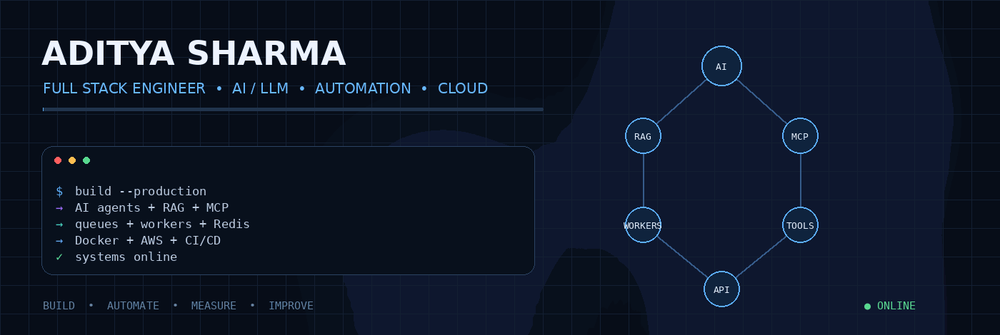
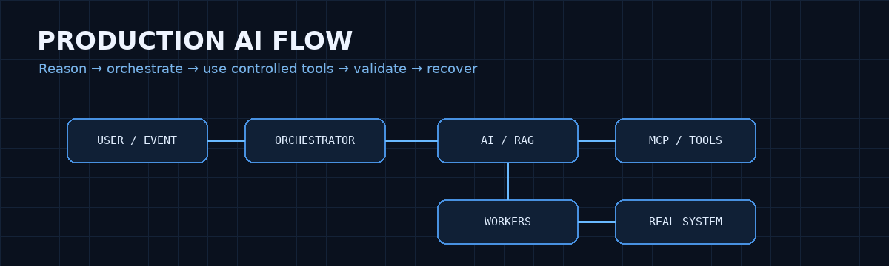

 

  

AI systems · automation · distributed backends · production engineering

<table>
<tr>
<td width="55%" valign="top">

01 — About

I build full-stack products where AI, automation, APIs, queues, and cloud infrastructure work together as one reliable system.

My engineering focus is on real workloads: asynchronous processing, retries, worker orchestration, validation, observability, and clean service boundaries.

</td>
<td width="45%" valign="top">

02 — Focus

AI / LLM
RAG + Agents + MCP

Backend
Node.js + Python

Systems
Queues + Workers + Redis

Cloud
AWS + Docker + CI/CD

</td>
</tr>
</table>

03 — Engineering Stack

Layer

Stack

Frontend

React · TypeScript · Vite · Tailwind CSS · shadcn/ui

Backend

Node.js · Express.js · Python · FastAPI

AI / LLM

RAG · Embeddings · Vector Search · LLM APIs · Agents · MCP

Data

PostgreSQL · MongoDB · Redis

Messaging

RabbitMQ · Queues · Retries · DLQ · Workers

Cloud / DevOps

AWS · Docker · GitHub Actions · CI/CD

04 — Selected Systems

<table>
<tr>
<td width="33%" valign="top">

AI Knowledge Platform

RAG · Semantic Search · LLM

Document ingestion, embeddings, semantic retrieval and LLM-powered answers with asynchronous processing.

Repository →

</td>
<td width="33%" valign="top">

AI Task Manager

React · TypeScript · AI

Modern task-management product focused on clean frontend architecture and AI-assisted workflows.

Repository →

</td>
<td width="33%" valign="top">

Developer Portfolio

React · GSAP · Three.js

Interactive portfolio built as a visual engineering showcase.

Repository →

</td>
</tr>
</table>

05 — Architecture Mindset

06 — Current Build Direction

<table>
<tr>
<td width="50%" valign="top">

Agentic AI

MCP / tool use

Multi-step workflows

Human-in-the-loop

AI evaluation

Controlled execution

</td>
<td width="50%" valign="top">

Distributed Automation

Event-driven processing

Queue-based workers

Retry / DLQ strategies

Observability

Failure recovery

</td>
</tr>
</table>

07 — Engineering Rules

Reliability        > flashy demos
Simple architecture > unnecessary complexity
Async workflows    > blocking long-running requests
Validation         > blind AI output
Controlled tools   > unrestricted agent access
Production thinking > tutorial thinking

BUILD → AUTOMATE → MEASURE → IMPROVE

 

<a href="https://aditya-sharma.lovable.app">Portfolio</a>  ·  <a href="https://github.com/Adi40709">GitHub</a>  ·  <a href="https://www.linkedin.com/in/aditya-sharma-788b41261/">LinkedIn</a>

