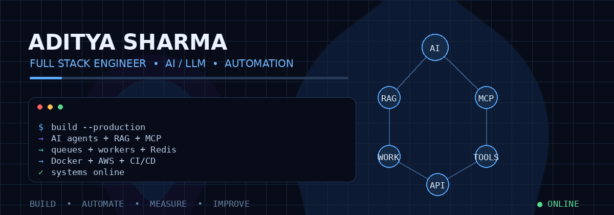

<div align="center">



<br>

<a href="https://github.com/Adi40709">

</a>
<a href="https://aditya-sharma.lovable.app">

</a>

</div>

---

## `01` — SYSTEM PROFILE

```text
┌──────────────────────────────────────────────────────────────────────┐
│  ADITYA SHARMA                                                       │
│  Full Stack Engineer • AI / LLM • Automation • Cloud                │
│                                                                      │
│  React / TypeScript ───────┐                                         │
│  Node.js / Python ─────────┼──► Production Applications             │
│  FastAPI / Express ────────┘                                         │
│                                                                      │
│  AI / LLM ─► RAG ─► Agents ─► MCP / Tool Use                       │
│                                                                      │
│  Redis ─► RabbitMQ ─► Workers ─► Distributed Automation             │
│                                                                      │
│  Docker ─► AWS ─► CI/CD ─► Observable Services                      │
└──────────────────────────────────────────────────────────────────────┘
```

I build **production-oriented software**, with a focus on AI/LLM systems, automation, scalable APIs, asynchronous workflows, and distributed backend architecture.

---

## `02` — STACK

| Layer | Technologies |
|---|---|
| **Frontend** | React · TypeScript · Vite · Tailwind CSS · shadcn/ui |
| **Backend** | Node.js · Express.js · Python · FastAPI |
| **AI / LLM** | RAG · Embeddings · Vector Search · Agents · MCP |
| **Data** | PostgreSQL · MongoDB · Redis |
| **Messaging** | RabbitMQ · Queues · Retries · DLQ · Workers |
| **Cloud** | AWS · Docker · GitHub Actions · CI/CD |

---

## `03` — FEATURED WORK

### `AI Knowledge Platform`
**RAG · Document Processing · Semantic Search · LLM**

Document ingestion and retrieval system designed around asynchronous processing, embeddings, semantic search, and LLM-powered answers.

**[View repository →](https://github.com/Adi40709/ai-knowledge-platform)**

### `AI Task Manager`
**React · TypeScript · AI-assisted productivity**

Modern task-management application with a clean component architecture and AI-assisted workflows.

**[View repository →](https://github.com/Adi40709/ai-task-manager)**

### `Developer Portfolio`
**React · TypeScript · GSAP · Three.js · WebGL**

Interactive portfolio built as a visual engineering showcase.

**[View repository →](https://github.com/Adi40709/aditya-portfolio)**

---

## `04` — CURRENT BUILD DIRECTION

```text
                         ┌───────────────┐
                         │   AI AGENT    │
                         └───────┬───────┘
                                 │
                         ┌───────▼───────┐
                         │ ORCHESTRATOR  │
                         └───────┬───────┘
                                 │
              ┌──────────────────┼──────────────────┐
              ▼                  ▼                  ▼
          ┌────────┐        ┌────────┐        ┌────────┐
          │  MCP   │        │ WORKER │        │ TOOLS  │
          └────────┘        └────────┘        └────────┘
              └──────────────────┼──────────────────┘
                                 ▼
                         ┌───────────────┐
                         │  REAL SYSTEM  │
                         └───────────────┘
```

**Agentic AI · MCP · Tool Use · Distributed Automation · AI Evaluation · Observability**

---

## `05` — ENGINEERING RULES

```text
Reliability > flashy demos
Simple architecture > unnecessary complexity
Async workflows > blocking long-running requests
Validation + observability > blind AI output
Controlled tools > unrestricted agent access
Production thinking > tutorial thinking
```

---

## `06` — NOW EXPLORING

`Agentic AI` · `MCP` · `Multi-step Workflows` · `Human-in-the-loop`
`AI Evaluation` · `Distributed Systems` · `Worker Orchestration`

---

<div align="center">

### BUILD → AUTOMATE → MEASURE → IMPROVE

<br>

<a href="https://aditya-sharma.lovable.app">Portfolio</a>
&nbsp;&nbsp;•&nbsp;&nbsp;
<a href="https://github.com/Adi40709">GitHub</a>

<br><br>


</div>
